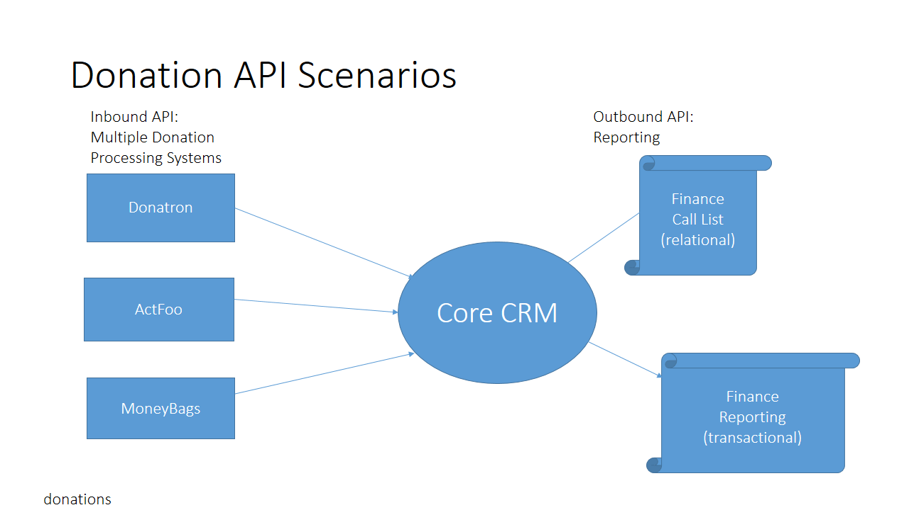
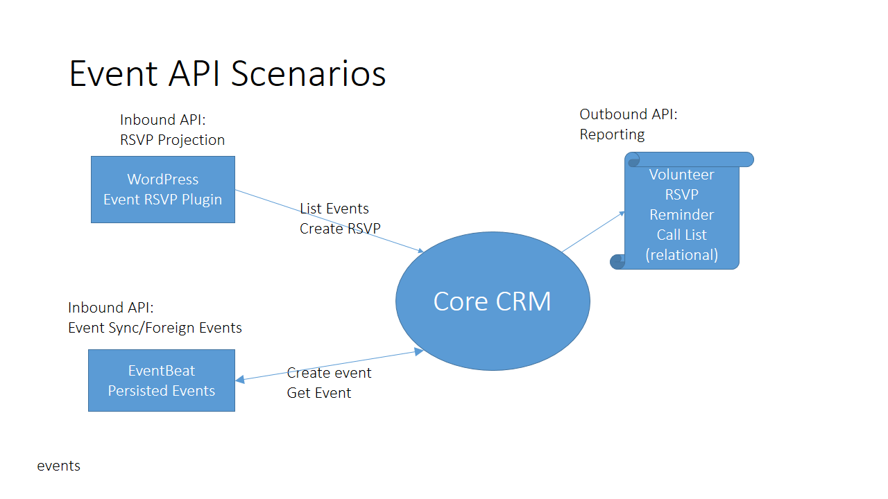

# Scenarios - Open Supporter Data Interface

The document outlines the scope of OSDI.  It describes the personas, model areas and scenarios to be addressed

# E2E Scenarios
## Donations

## Events

# Personas
## Supporter
Sam the supporter is an end user.  She visits a campaign website, attends campaign events and receives email updates from the campaign.  She may also volunteer, make donations, sign petitions or take other actions for the campaign.

## Canvasser
Claire the canvasser started as a supporter but now is significantly engaged with the campaign.  She runs and participates in phone banks, uses social calling and email tools to recruit her friends to become supporters.  She has conversations with voters about the issue and records the results.  

## Social Media Manager
Sally the social media manager started her career in communications and PR.  She's gone digital and now specializes in social media services.  She's all over Twitter, Facebook and the rest. She helps compose emails.

She uses google analytics, hootsuite, and other services to study engagement metrics.  She gets frustrated when emails, social media messages and links go out to the membership without appropriate tracking tags.
She would like to see more integrated analytics between what's on the social media universe and the backend campaign tools and CRMs.
Sally is a regular presenter at Social Media Week and RootsCamp.

## Data Manager

Dan the data manager has a background in political science and economics.  He's got many years of experience working with campaigns and analyzing voter data.  He is a master with Excel, CSV and VAN.  He wishes that the administrator dashboards of his tools could do better analytics.  He knows excel macros and understands query builder semantics.  He can understand SQL queries.  

He convinced Webber, the web developer, to write scripts to generate specific reports that get emailed to him every morning.
He lives in Brooklyn and rides a fixie to work.

## Web Developer
Webber the web developer developed the campaign's web site and CRM web templates.    He also helps out at the office with IT problems and sooths staff when they can't print.  He is self-taught and does not have a computer science degree. He is proficient with HTML, JavaScript, WordPress and knows some PHP.  He is learning Ruby. He knows how to use CURL and can parse simple JSON.  He is studying for his MCSE

He's written a tool to query the CRM API and show the latest volunteer signups with WordPress and PHP as well as email them to the data manager.

He runs the campaign's back-end systems and servers.

## Product Developer

Paula the Product Developer went to Prestigious University and graduated with a masters in computer science.  She's got previous work at a CRM platform company and ACME Digital Political Consulting.  She has now joined a new startup working on a social fundraising tool  She is proficient in Ruby on Rails, Node.js, C, Perl, XML, JSON, EC2, Heroku, REST and SOAP.  

She knows URIs are supposed to be opaque.  Parsing complex models and thinking about cache invalidation strategies are hobbies. 

	

# Use Cases

## Data Manager Cases
###	Signup Analytics
The data manager visits an administrative dashboard application.  He uses a UI query tool to select supporters who have been signed up in the past 24 hours.  

## End User Supporter Cases
### Web Form style Supporter Signup
A campaign website has a signup form for supporters.  It includes basic information like:

* First Name
* Last Name
* Address
* City
* ZIP
* State
* [ ] I wish to volunteer (checkbox)
* Multiple Choice Question: 
	* A: No Answer
	* B: phonebank
	* C: canvass
	* D: do data entry

The supporter fills out the fields and clicks submit.  

The system processes the data and:

1.	Updates or creates a new record for the supporter
2.	If the checkbox is checked, then the system applies the 'volunteer' tag to the supporter's record
3.	If the supporter has answered the multiple choice question, then the system records the supporters answer to the question and associates it to the supporter's record

### Event Listing
A campaign website lists a series of events for supporters to see as follows:
 
Each event listing contains the title, description, date.
Each event listing has an RSVP button where the user can sign up

###	Event RSVP
A campaign website lists a series of events and allows supporters to RSVP for a given event.  After reviewing a listing of events, the supporter selects one of interest and is presented with a signup form:
 
The supporter fills out the fields, including supporter information and the preferred shift at the event that she wishes to attend.
When the supporter clicks the "RSVP" submit button, the system

1.	Creates a new or updates an existing supporter record
2.	Applies the 'volunteer' tag to the supporter record
3.	Records that the supporter has RSVP'd to this event

### Donation

The supporter visits the campaign website and chooses to make a donation.  She clicks a prominently displayed "Donate" button and is presented with the following form:
 
 
Once the supporter clicks the "Process Donation" button, the system will:
1.	Create a new or update an existing supporter record with the form data
2)	Process the payment of the donation [THIS STEP IS OUT OF BAND FROM OSDI]
3.	Create a Donation record containing the amount, transaction ID, and donation page ID
4.	Associates the new Donation record with the supporter record

## Web Developer Cases
### Simple Resource Access
1.	The client requests a single resource
2.	The client updates the previously retrieved resource

### Person Resource Query
Webber writes a script that queries the CRM for the newest volunteers.
The client performs a query to retrieve a set of Person resources matching a set of criteria.
1.	Client queries for a set of Persons who are tagged as ‘volunteer’ within the last 24 hours

### Person Match
A client has a subset of information about a Person and seeks to retrieve the Person resource that most closely matches this information

1.	Client performs a Match for John Doe with zip code of 98102

### Survey Questions
A campaign has a set of survey questions like "Do you support Marriage Equality" with answers "Yes", or "No"

#### Add a question response
A client will

1. query the service to find the person 'bob.smith@example.com'
2. add a question answer to bob's person record identifying the question and answer

#### Query all people with a certain question answer
The client wishes to find a list of all people who responded with "Yes" to "Do you support Marriage Equality?"

1. query the service for people where the answer "Yes" has been specified for the question
 
# 2	Model Areas

The specification shall address the following model areas:

* Person
* Addresses
* Interaction
* Tag
* Event
* EventRSVP
* Donation
* Question
* QuestionResponse
* QuestionAnswer

Out of scope for V1 (v2)

* Groups
* Relationship (eg familial)
* Script (collection of questions)
* Campaign